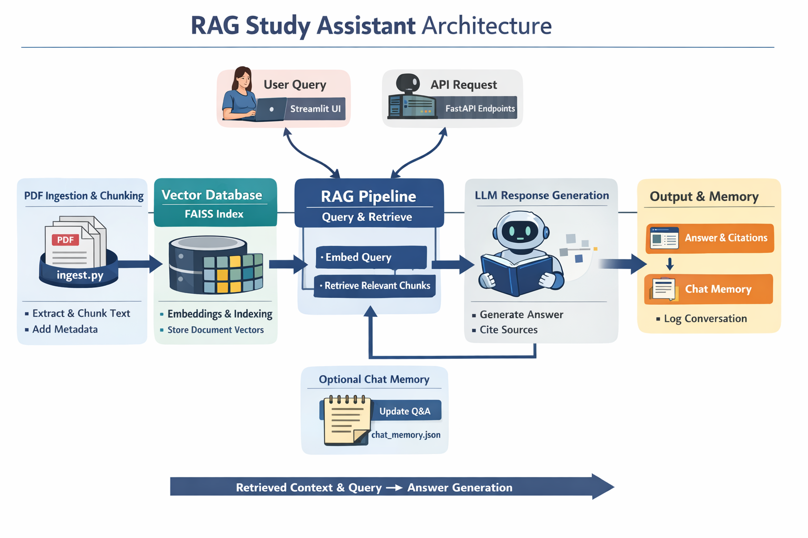

# 📚 Advanced RAG Study Assistant

An offline **Retrieval-Augmented Generation (RAG)** study assistant that helps you query multiple PDFs and get context-aware answers with citations.  
It includes a **Streamlit frontend** for interactive use and a **FastAPI backend** for programmatic access. Built with **Ollama Mistral**, **FAISS**, and **LangChain**.

---

## **Architecture**



The diagram above illustrates the complete data flow:
1. **PDF Ingestion**: Documents are processed and chunked via `ingest.py`
2. **Vector Database**: Text chunks are embedded and stored in FAISS index
3. **RAG Pipeline**: User queries are embedded and matched against relevant document chunks
4. **LLM Generation**: Ollama Mistral generates answers with source citations
5. **Chat Memory**: Conversation history is maintained for multi-turn interactions

---

## **Features**

- Multi-PDF ingestion with metadata tracking
- Semantic search using **FAISS** + embeddings (`all-mpnet-base-v2`)
- Answers generated by **Ollama Mistral** LLM
- Multi-turn **chat memory** (previous questions/answers remembered)
- Highlighted source citations in answers `(PDF: ..., Page X)`
- Optional **Summarization** and **Quiz generation** endpoints (extensible)
- Streamlit UI + FastAPI backend for maximum flexibility
- Fully offline and local

---

## **Project Structure**
```bash
rag_study_advanced/
│
├── app.py # Streamlit frontend
├── api.py # FastAPI backend
├── ingest.py # PDF ingestion + FAISS
├── rag_pipeline.py # Retrieval + LLM logic
├── chat_memory.json # Multi-turn chat memory
├── faiss_index/ # FAISS vector DB
└── requirements.txt 
```

## **Key dependencies:**

- streamlit
- fastapi, uvicorn
- langchain, langchain-community, langchain-text-splitters
- sentence-transformers
- transformers
- faiss-cpu
- pypdf
- torch, torchvision, torchaudio
---

## **Installation**

1. Clone the repository:

```bash
git clone <your-repo-url>
cd rag_study_advanced
```

2. Create and activate a Python virtual environment:
PowerShell:

```bash
python -m venv rag_env
.\rag_env\Scripts\Activate.ps1
```

CMD:
```bash
python -m venv rag_env
rag_env\Scripts\activate.bat
```
3. Install dependencies:

```bash
pip install -r requirements.txt
```
##  Usage
**Run Streamlit Frontend**
```bash
streamlit run app.py
```
- Open in browser: http://localhost:8501
- Upload PDFs
- Ask questions interactively
- Reset conversation memory if needed

**Run FastAPI Backend**
```bash
uvicorn api:app --reload
```

- API Docs (Swagger UI): http://127.0.0.1:8000/docs

- Endpoints:

    - /upload_pdfs/ → Upload PDFs to build FAISS index

    - /ask/ → Ask questions programmatically

- Supports multi-turn chat memory

## Example API Usage (cURL)

**Upload PDFs:**
```bash
curl -F "files=@notes1.pdf" -F "files=@notes2.pdf" http://127.0.0.1:8000/upload_pdfs/
```
```bash
curl -X POST -F "question=Explain photosynthesis" http://127.0.0.1:8000/ask/
```
```bash
{
  "question": "Explain photosynthesis",
  "answer": "(PDF: BiologyNotes.pdf | Page 12) Photosynthesis is the process..."
}
```

## **⚡ Notes**

- Chat memory stored in chat_memory.json.
- Answers include PDF filename and page number for citations.
- FAISS vector store is saved locally in faiss_index/.
- Ollama Mistral can run locally offline (make sure it’s installed and configured).

## **📃 License**

MIT License — free for academic, personal, and portfolio use.