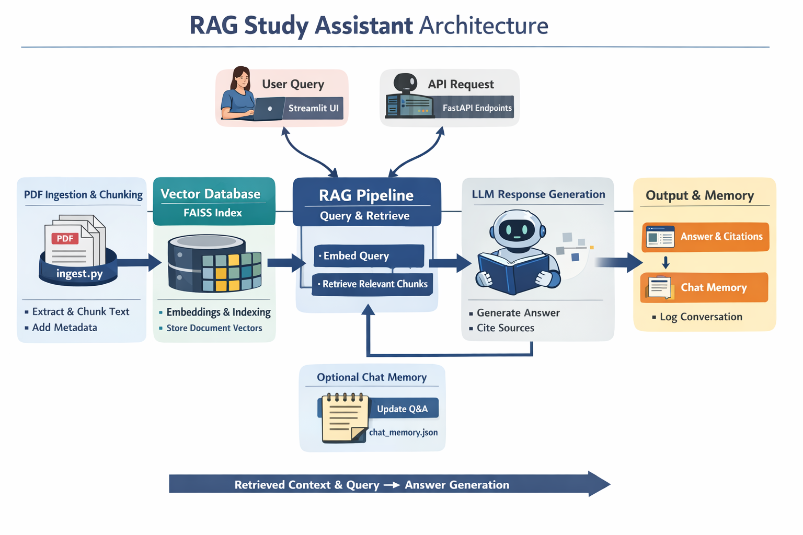

# 📚 RAG Study Assistant

Upload PDFs, ask questions, get answers grounded in them — retrieval with
MiniLM + FAISS, generation by a small open model running on free CPU.
No API keys, no quotas.



- **Live demo:** Streamlit Community Cloud (`app.py`)
- **API:** `api.py`, FastAPI, for local programmatic use

## Pipeline

1. `ingest.py` — PDFs → 800-char chunks (200 overlap) → MiniLM embeddings → FAISS
2. `rag_pipeline.py` — retrieve top-k → build a grounded prompt → stream tokens
3. `app.py` — chat UI, with the retrieved passages shown for every answer

## Model choice

Measured on CPU, 199-token retrieved context, forced 80-token answer:

| Config | Peak RSS | Prefill | Decode | Total |
|---|---|---|---|---|
| Qwen2.5-0.5B float32 | 2686 MB | — | — | — |
| **Qwen2.5-0.5B bfloat16** | **1568 MB** | 6.4s | **18.0 tok/s** | **10.8s** |
| SmolLM2-360M float32 | 2027 MB | 1.1s | 7.4 tok/s | 11.9s |

float32 does not fit Streamlit Community Cloud's ~2.7 GB ceiling once
Streamlit's own ~200 MB is counted. bfloat16 fits with ~900 MB spare and is
*faster* at decode despite the CPU lacking native bf16 matmul — token
generation is memory-bandwidth-bound, so halving bytes-per-weight wins more
than the upcast costs. It loses only on prefill, which is compute-bound.

Override with the `LLM_MODEL` environment variable.

## Honest limitations

- **Inline citations are inconsistent.** The prompt asks for
  `(PDF: file.pdf, Page N)` and a 0.5B model often ignores it. The retrieved
  passages are always listed with filenames and page numbers under each answer,
  so you can verify grounding regardless.
- **A 0.5B model is small.** It is good at extracting an answer that is present
  in the retrieved text, and weak at synthesis across passages.
- **Scanned PDFs will not work** — there is no OCR step. They are detected and
  reported rather than silently indexed as empty.
- Capped at 120 pages per session to stay inside the free tier.

## Privacy

Uploaded PDFs are held in `st.session_state` for the browser session only.
Nothing is written to disk, nothing is shared between visitors, everything is
gone when the tab closes.

Earlier versions persisted `faiss_index/` and `chat_memory.json` to the working
directory. On a single-process shared host that means one visitor querying
another visitor's documents, so both were moved into session state.

## Run locally

```bash
pip install -r requirements.txt
streamlit run app.py          # UI
uvicorn api:app --reload      # API, docs at /docs
```

## License

MIT
